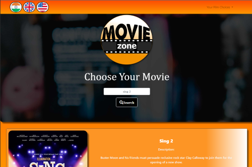

# **Movie-Zone App**

# User Story
As a movie goer I want to easily search for a released movie and receive *ratings*, a short description and the places that I can stream, buy or rent it from.
I also want to be able to store my recent searches for future references and update them when I want to.

# Description
The Movie-Zone is a responsive front-end application that allows the user to search movie databases for a film of their choice.

When the Movie-Zone application is first opened, the user can see a navigation bar to choose their country and a search box to type in a movie title.
On clicking the search button, the result is displayed below as a poster, movie title, short description and includes “like” and “watch now” buttons. 
- The "like" button saves the movie details as a favourite which can then be accessed from the dropdown menu in the navigation bar.
- The "dislike" button moves a film from the favourites dropdown menu.
- The "watch now" button links to a second page displaying the location details of the movie such as on TV, streaming, renting and buying 

There is also a "subscribe" button which pops up a modal to enter your email address to be added to the Movie Zone mailing list for future updates.

The second page is presented as cards containing information and links to the  different service providers where you can access the movie from.

# Demo

\
\

\
\
See the live version of the Movie Zone App
# -----INSERT LIVE LINK----

Go behind the scenes 
https://github.com/zakirali1/Movie-Zone
 

# Technologies Used
- HTML
- JavaScript
- JQuery
- CSS
- Bootstrap
- Rapid API
- OMDB API

# Installation

-----To be added-----

# Future Updates
- The application will be updated to include new cinema released movies and screen locations.
- To simplify the app so it's more user friendly, the results could be integrated to one page.
- Additional countries can be added to become more universal
 

# Contributors
Zakhira https://github.com/zakirali1  
Wojtek https://github.com/W-JK 
Yemi https://github.com/YemiOyedeji89 
Lola https://github.com/19Lola89 
Toni https://github.com/Lucasiti

